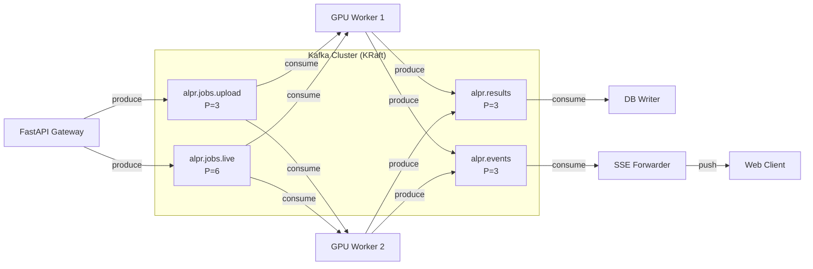

# Tích Hợp Apache Kafka vào Hệ Thống ALPR

## Mục tiêu

Tách hệ thống monolith hiện tại thành kiến trúc **event-driven microservices** sử dụng Apache Kafka làm message broker trung tâm, cho phép xử lý đồng thời nhiều video upload và live camera streams.

## Lý thuyết Kafka áp dụng

### Kafka Topics cho ALPR



| Topic | Partitions | Key | Mục đích |
|:---|:---|:---|:---|
| `alpr.jobs.upload` | 3 | `job_id` | Task queue cho video uploads |
| `alpr.jobs.live` | 6 | `session_id` | Frame batches từ live cameras |
| `alpr.results` | 3 | `job_id` | Kết quả OCR từ workers |
| `alpr.events` | 3 | `job_id` | Progress/vehicle events cho SSE |

### Consumer Groups

- **`alpr-gpu-workers`**: GPU workers consume từ `alpr.jobs.*` — mỗi partition chỉ 1 consumer xử lý → đảm bảo ordering per-job
- **`alpr-db-writers`**: Persist results vào MongoDB
- **`alpr-sse-forwarders`**: Forward events tới SSE connections

---

## Phân Tích Codebase Hiện Tại

### Data Flow hiện tại (cần thay đổi)

```
POST /upload → file.read() → asyncio.Queue → run_in_executor → run_job()
  → pipeline_async.process_frames_async() [3 threads: reader→vehicle→plate/OCR]
  → emit() → queue.put_nowait() → SSE /stream/{job_id}
```

### Các file cần thay đổi

| File | Thay đổi | Lý do |
|:---|:---|:---|
| `docker-compose.yml` | Thêm Kafka + Kafka UI | Infrastructure |
| `requirements.txt` | Thêm `aiokafka` | Dependency |
| `api/core/config.py` | Thêm Kafka config vars | Configuration |
| `api/main.py` | Producer lifecycle + sửa `/upload`, `/stream` | API Gateway role |
| `api/routes_monitor.py` | Sửa monitor upload/live dùng Kafka | Monitor flows |

### Các file MỚI cần tạo

| File | Mục đích |
|:---|:---|
| `api/kafka/__init__.py` | Package init |
| `api/kafka/config.py` | Kafka connection config, topic names |
| `api/kafka/producer.py` | Async Kafka producer singleton |
| `api/kafka/consumer.py` | Base consumer class với graceful shutdown |
| `api/kafka/schemas.py` | Pydantic models cho Kafka messages |
| `api/kafka/topics.py` | Topic creation/management utility |
| `worker/__init__.py` | Worker package |
| `worker/gpu_worker.py` | GPU inference worker (consume jobs → produce results) |
| `worker/sse_forwarder.py` | Consume events → push tới SSE clients |
| `worker/db_writer.py` | Consume results → persist MongoDB |
| `worker/Dockerfile` | Docker image cho GPU worker |

---

## Proposed Changes

### 1. Infrastructure

#### [MODIFY] [docker-compose.yml](file:///home/vietanh/Documents/DATN/ALPR_Vietnamese/docker-compose.yml)

Thêm Kafka (KRaft mode, không cần Zookeeper) và Kafka UI:

```yaml
  kafka:
    image: apache/kafka:3.9.0
    container_name: alpr-kafka
    ports:
      - "9092:9092"
    environment:
      KAFKA_NODE_ID: 1
      KAFKA_PROCESS_ROLES: broker,controller
      KAFKA_LISTENERS: PLAINTEXT://0.0.0.0:29092,CONTROLLER://0.0.0.0:9093,EXTERNAL://0.0.0.0:9092
      KAFKA_ADVERTISED_LISTENERS: PLAINTEXT://kafka:29092,EXTERNAL://localhost:9092
      KAFKA_LISTENER_SECURITY_PROTOCOL_MAP: CONTROLLER:PLAINTEXT,PLAINTEXT:PLAINTEXT,EXTERNAL:PLAINTEXT
      KAFKA_CONTROLLER_LISTENER_NAMES: CONTROLLER
      KAFKA_CONTROLLER_QUORUM_VOTERS: 1@kafka:9093
      KAFKA_OFFSETS_TOPIC_REPLICATION_FACTOR: 1
      KAFKA_TRANSACTION_STATE_LOG_REPLICATION_FACTOR: 1
      KAFKA_TRANSACTION_STATE_LOG_MIN_ISR: 1
      KAFKA_GROUP_INITIAL_REBALANCE_DELAY_MS: 0
      KAFKA_LOG_RETENTION_HOURS: 24
      KAFKA_MESSAGE_MAX_BYTES: 1048576
    volumes:
      - kafka_data:/var/lib/kafka/data
    restart: unless-stopped

  kafka-ui:
    image: provectuslabs/kafka-ui:latest
    ports:
      - "8080:8080"
    environment:
      KAFKA_CLUSTERS_0_NAME: alpr-local
      KAFKA_CLUSTERS_0_BOOTSTRAPSERVERS: kafka:29092
    depends_on:
      - kafka
```

**Tác dụng**: Single-node Kafka với KRaft consensus (không cần Zookeeper), 2 listeners (internal cho containers, external cho host), Kafka UI để monitor topics/consumers.

#### [MODIFY] [requirements.txt](file:///home/vietanh/Documents/DATN/ALPR_Vietnamese/requirements.txt)

```diff
+aiokafka>=0.10.0
```

**Tác dụng**: Async Kafka client cho Python, native `asyncio` support, dùng trong cả FastAPI producer và worker consumers.

---

### 2. Kafka Package

#### [NEW] `api/kafka/__init__.py`

```python
"""Kafka integration for ALPR distributed processing."""
```

#### [NEW] `api/kafka/config.py`

Kafka connection settings + topic names, đọc từ env:

```python
KAFKA_BOOTSTRAP_SERVERS = os.environ.get("KAFKA_BOOTSTRAP_SERVERS", "localhost:9092")

# Topic names
TOPIC_JOBS_UPLOAD = "alpr.jobs.upload"
TOPIC_JOBS_LIVE = "alpr.jobs.live"
TOPIC_RESULTS = "alpr.results"
TOPIC_EVENTS = "alpr.events"

# Consumer groups
GROUP_GPU_WORKERS = "alpr-gpu-workers"
GROUP_DB_WRITERS = "alpr-db-writers"
GROUP_SSE_FORWARDERS = "alpr-sse-forwarders"

# Concurrency limits
MAX_CONCURRENT_UPLOAD_JOBS = int(os.environ.get("MAX_CONCURRENT_UPLOAD_JOBS", "3"))
MAX_CONCURRENT_LIVE_STREAMS = int(os.environ.get("MAX_CONCURRENT_LIVE_STREAMS", "8"))
```

**Tác dụng**: Single source of truth cho tất cả Kafka settings. Dùng env vars để dễ config khác nhau giữa dev/staging/prod.

#### [NEW] `api/kafka/schemas.py`

Pydantic message schemas — serializable qua JSON:

```python
class UploadJobMessage(BaseModel):
    """Message gửi vào topic alpr.jobs.upload khi user upload video."""
    job_id: str
    video_path: str           # path trên shared filesystem
    filename: str
    preprocess_mode: str
    created_at: datetime

class LiveFrameBatch(BaseModel):
    """Batch frame references từ live camera."""
    session_id: str
    batch_id: str
    frame_indices: list[int]
    shared_memory_key: str    # key tới shared memory buffer
    timestamp: float

class ALPRResultMessage(BaseModel):
    """Kết quả nhận diện biển số từ GPU worker."""
    job_id: str
    track_id: int
    vehicle_class: str
    plate_text: str
    plate_confidence: float
    chars: list[tuple[str, float]]
    plate_image_b64: str | None
    vehicle_image_b64: str | None
    ocr_frames: int
    is_final: bool

class ALPREventMessage(BaseModel):
    """Event cho SSE stream (progress, vehicle update, complete, error)."""
    job_id: str
    event_type: str  # "progress" | "vehicle" | "complete" | "error"
    payload: dict
```

**Tác dụng**: Type-safe message contracts giữa producer và consumer. Đảm bảo tất cả services "nói cùng ngôn ngữ".

#### [NEW] `api/kafka/producer.py`

Singleton async producer, khởi tạo trong FastAPI lifespan:

```python
class KafkaProducerManager:
    """Manages a single AIOKafkaProducer instance for the FastAPI app."""

    def __init__(self):
        self._producer: AIOKafkaProducer | None = None

    async def start(self, bootstrap_servers: str):
        self._producer = AIOKafkaProducer(
            bootstrap_servers=bootstrap_servers,
            value_serializer=lambda v: json.dumps(v, default=str).encode(),
            key_serializer=lambda k: k.encode() if k else None,
            acks="all",                    # đảm bảo message được ghi vào tất cả replicas
            max_request_size=1_048_576,    # 1MB max message
            linger_ms=5,                   # batch nhỏ để giảm latency
        )
        await self._producer.start()

    async def stop(self):
        if self._producer:
            await self._producer.stop()

    async def send(self, topic: str, key: str, value: dict):
        await self._producer.send_and_wait(topic, key=key, value=value)

    async def send_fire_and_forget(self, topic: str, key: str, value: dict):
        await self._producer.send(topic, key=key, value=value)

# Global singleton
producer_manager = KafkaProducerManager()
```

**Tác dụng**: Một producer duy nhất shared across tất cả requests. `acks="all"` đảm bảo không mất message. `linger_ms=5` batch nhỏ các messages gửi cùng lúc.

#### [NEW] `api/kafka/consumer.py`

Base consumer với graceful shutdown pattern:

```python
class BaseKafkaConsumer:
    """Base class cho tất cả Kafka consumers trong hệ thống."""

    def __init__(self, topics, group_id, bootstrap_servers):
        self._consumer = AIOKafkaConsumer(
            *topics,
            bootstrap_servers=bootstrap_servers,
            group_id=group_id,
            value_deserializer=lambda m: json.loads(m.decode()),
            auto_offset_reset="earliest",
            enable_auto_commit=False,      # manual commit sau khi xử lý xong
            max_poll_records=1,            # 1 job tại 1 thời điểm (GPU bound)
        )
        self._running = False

    async def start(self):
        await self._consumer.start()
        self._running = True

    async def stop(self):
        self._running = False
        await self._consumer.stop()

    async def run(self):
        """Main consume loop — subclasses override process_message()."""
        await self.start()
        try:
            async for msg in self._consumer:
                if not self._running:
                    break
                try:
                    await self.process_message(msg)
                    await self._consumer.commit()
                except Exception as e:
                    logger.exception("Failed to process message: %s", e)
                    # Message stays uncommitted → will be redelivered
        finally:
            await self.stop()

    async def process_message(self, msg) -> None:
        raise NotImplementedError
```

**Tác dụng**: Manual commit pattern — message chỉ commit sau khi xử lý thành công. Nếu worker crash giữa chừng, Kafka tự redelivery message cho worker khác.

#### [NEW] `api/kafka/topics.py`

Auto-create topics khi startup:

```python
async def ensure_topics(bootstrap_servers: str):
    """Tạo tất cả required topics nếu chưa tồn tại."""
    admin = AIOKafkaAdminClient(bootstrap_servers=bootstrap_servers)
    await admin.start()
    try:
        existing = await admin.list_topics()
        topics_to_create = []
        for name, partitions in REQUIRED_TOPICS.items():
            if name not in existing:
                topics_to_create.append(
                    NewTopic(name=name, num_partitions=partitions, replication_factor=1)
                )
        if topics_to_create:
            await admin.create_topics(topics_to_create)
    finally:
        await admin.close()
```

**Tác dụng**: Tự động tạo topics với đúng số partitions khi hệ thống khởi động. Không cần tạo thủ công.

---

### 3. API Gateway Changes

#### [MODIFY] [main.py](file:///home/vietanh/Documents/DATN/ALPR_Vietnamese/api/main.py)

**Thay đổi 1**: Lifespan — thêm Kafka producer lifecycle

```python
@asynccontextmanager
async def lifespan(app: FastAPI):
    # Load models (giữ nguyên)
    app.state.models = load_models()

    # Kafka producer startup
    from api.kafka.producer import producer_manager
    from api.kafka.topics import ensure_topics
    from api.kafka.config import KAFKA_BOOTSTRAP_SERVERS
    await ensure_topics(KAFKA_BOOTSTRAP_SERVERS)
    await producer_manager.start(KAFKA_BOOTSTRAP_SERVERS)

    # SSE forwarder — consume events từ Kafka, push tới SSE clients
    app.state.sse_forwarder = SSEForwarder()
    sse_task = asyncio.create_task(app.state.sse_forwarder.run())

    # ... existing setup ...
    yield

    # Shutdown
    await producer_manager.stop()
    sse_task.cancel()
    # ... existing cleanup ...
```

**Tác dụng**: Producer sống cùng vòng đời của FastAPI app. SSE Forwarder chạy background consume `alpr.events` topic.

**Thay đổi 2**: POST `/upload` — produce message thay vì run_in_executor

```python
@app.post("/upload")
async def upload(request: Request, file: UploadFile, preprocess_mode: str = Form("none")):
    job_id = uuid.uuid4().hex[:8]

    # Chunked write (không load toàn bộ vào RAM)
    suffix = Path(file.filename or "video.mp4").suffix or ".mp4"
    upload_dir = Path(tempfile.gettempdir()) / "alpr_uploads"
    upload_dir.mkdir(exist_ok=True)
    tmp_path = upload_dir / f"{job_id}{suffix}"
    async with aiofiles.open(tmp_path, "wb") as f:
        while chunk := await file.read(1024 * 1024):  # 1MB chunks
            await f.write(chunk)

    # Produce job message tới Kafka
    await producer_manager.send(
        topic=TOPIC_JOBS_UPLOAD,
        key=job_id,
        value=UploadJobMessage(
            job_id=job_id,
            video_path=str(tmp_path),
            filename=file.filename or "video.mp4",
            preprocess_mode=normalize_preprocess_mode(preprocess_mode),
            created_at=datetime.now(timezone.utc),
        ).model_dump(mode="json"),
    )

    # Register SSE channel cho job này
    request.app.state.sse_forwarder.register(job_id)

    return {"job_id": job_id, "preprocess_mode": preprocess_mode}
```

**Tác dụng**: API chỉ save file + produce message. Không xử lý nặng. Chunked write tránh OOM.

**Thay đổi 3**: GET `/stream/{job_id}` — nhận events từ SSE Forwarder

```python
@app.get("/stream/{job_id}")
async def stream(request: Request, job_id: str):
    forwarder = request.app.state.sse_forwarder
    if not forwarder.has_channel(job_id):
        return HTMLResponse("Job not found", status_code=404)

    async def gen():
        async for event in forwarder.subscribe(job_id):
            yield f"data: {json.dumps(event, ensure_ascii=False)}\n\n"
            if event.get("type") in ("complete", "error"):
                break

    return StreamingResponse(gen(), media_type="text/event-stream", ...)
```

**Tác dụng**: SSE endpoint giờ đọc events từ Kafka consumer (SSE Forwarder) thay vì in-memory queue.

---

### 4. GPU Worker (Process riêng)

#### [NEW] `worker/gpu_worker.py`

Worker chính — consume upload jobs, chạy ALPR pipeline, produce results:

```python
class GPUWorker(BaseKafkaConsumer):
    """GPU inference worker. Mỗi instance xử lý 1 job tại 1 thời điểm."""

    def __init__(self, gpu_id: int = 0):
        super().__init__(
            topics=[TOPIC_JOBS_UPLOAD],
            group_id=GROUP_GPU_WORKERS,
            bootstrap_servers=KAFKA_BOOTSTRAP_SERVERS,
        )
        self.gpu_id = gpu_id
        self.models = None
        self.result_producer = None

    async def setup(self):
        """Load models lên GPU — chạy 1 lần khi worker start."""
        os.environ["CUDA_VISIBLE_DEVICES"] = str(self.gpu_id)
        self.models = load_models()
        self.result_producer = AIOKafkaProducer(...)
        await self.result_producer.start()

    async def process_message(self, msg):
        """Xử lý 1 upload job hoàn chỉnh."""
        job = UploadJobMessage.model_validate(msg.value)

        # emit() giờ produce tới Kafka thay vì in-memory queue
        async def emit(event: dict):
            await self.result_producer.send(
                TOPIC_EVENTS,
                key=job.job_id.encode(),
                value=json.dumps({**event, "job_id": job.job_id}).encode(),
            )

        # Chạy pipeline (blocking GPU work trong thread)
        source = FileFrameSource(job.video_path)
        summary = await asyncio.to_thread(
            process_frames_async,
            source, emit_sync, self.models,
            session_id=job.job_id,
        )

        # Produce completion event
        await emit({"type": "complete", "total_vehicles": summary["total_vehicles"]})

        # Cleanup temp file
        Path(job.video_path).unlink(missing_ok=True)

if __name__ == "__main__":
    worker = GPUWorker(gpu_id=int(os.environ.get("GPU_ID", "0")))
    asyncio.run(worker.setup())
    asyncio.run(worker.run())
```

**Tác dụng**: Chạy riêng biệt từ API. Load models 1 lần, consume jobs liên tục. Scale bằng cách chạy thêm instances (`docker compose up --scale worker=N`). Kafka tự load-balance jobs qua consumer group.

#### [NEW] `worker/sse_forwarder.py`

Consume `alpr.events` → push tới connected SSE clients:

```python
class SSEForwarder:
    """Bridge giữa Kafka events topic và SSE connections."""

    def __init__(self):
        self._channels: dict[str, asyncio.Queue] = {}

    def register(self, job_id: str):
        self._channels[job_id] = asyncio.Queue()

    def has_channel(self, job_id: str) -> bool:
        return job_id in self._channels

    async def subscribe(self, job_id: str):
        q = self._channels[job_id]
        while True:
            event = await asyncio.wait_for(q.get(), timeout=60.0)
            yield event
            if event.get("type") in ("complete", "error"):
                self._channels.pop(job_id, None)
                break

    async def run(self):
        """Background task: consume Kafka events, route tới đúng SSE channel."""
        consumer = AIOKafkaConsumer(
            TOPIC_EVENTS,
            bootstrap_servers=KAFKA_BOOTSTRAP_SERVERS,
            group_id=GROUP_SSE_FORWARDERS,
        )
        await consumer.start()
        async for msg in consumer:
            event = json.loads(msg.value)
            job_id = event.get("job_id")
            if job_id and job_id in self._channels:
                await self._channels[job_id].put(event)
```

**Tác dụng**: Mỗi SSE client đăng ký 1 channel bằng `job_id`. Forwarder consume từ Kafka và route event tới đúng client. Nếu API restart, events vẫn nằm trong Kafka — không mất.

#### [NEW] `worker/db_writer.py`

Consume results → persist MongoDB (tách khỏi GPU worker):

```python
class DBWriter(BaseKafkaConsumer):
    """Consume ALPR results và persist vào MongoDB."""

    async def process_message(self, msg):
        result = ALPRResultMessage.model_validate(msg.value)
        if result.is_final:
            record = build_recognition_record(result)
            await upsert_record(record)
```

**Tác dụng**: DB writes tách khỏi GPU worker → GPU worker không bị block bởi MongoDB latency. DB writer có thể batch writes để tối ưu.

---

### 5. Monitor Routes Changes

#### [MODIFY] [routes_monitor.py](file:///home/vietanh/Documents/DATN/ALPR_Vietnamese/api/routes_monitor.py)

- `POST /monitor/upload` → produce `UploadJobMessage` thay vì save vào `monitor_sessions`
- `POST /monitor/{session_id}/mark` → produce `MarkJobMessage` thay vì submit to `_incident_executor`
- `POST /monitor/live/connect` → produce `LiveConnectMessage`, worker sẽ manage `LiveSession`
- Giữ nguyên upload file serving (`GET /monitor/upload/{session_id}/video`)

---

## Verification Plan

### Automated Tests

```bash
# 1. Start infrastructure
docker compose up -d kafka kafka-ui mongo mediamtx

# 2. Verify Kafka is healthy
docker exec alpr-kafka /opt/kafka/bin/kafka-topics.sh --bootstrap-server localhost:9092 --list

# 3. Start GPU worker
python -m worker.gpu_worker

# 4. Start API
uvicorn api.main:app --reload

# 5. Test upload flow
curl -X POST http://localhost:8000/upload -F "file=@test_video.mp4"
# → Should return job_id
# → Check Kafka UI: message in alpr.jobs.upload
# → Worker logs: processing started
# → SSE stream: events flowing
```

### Manual Verification

1. Upload 3 videos đồng thời → xác nhận tất cả được xử lý (parallel nếu có 2+ workers)
2. Connect live camera → mark incident → xác nhận results qua SSE
3. Kill worker mid-job → restart → xác nhận job được reprocessed (Kafka redelivery)
4. Check Kafka UI: consumer lag, throughput, partition assignment

## Open Questions

> [!IMPORTANT]
> **Shared filesystem**: Workers cần truy cập video files mà API đã save. Trong Docker, cần mount shared volume. Dùng named volume hay bind mount?

> [!IMPORTANT]
> **Live stream strategy**: Live frames quá lớn để gửi qua Kafka (message size limit 1MB). Hai options:
> 1. Worker tự connect RTSP qua MediaMTX (worker cần network access tới MediaMTX)
> 2. Shared memory / file-based frame buffer
>
> Đề xuất option 1 — worker connect trực tiếp RTSP, API chỉ gửi connection metadata qua Kafka.

> [!WARNING]
> **Model loading**: Mỗi worker phải load models riêng (~2-3GB VRAM). Với 1 GPU, nên chạy 1 worker. Với multi-GPU, mỗi GPU 1 worker.
